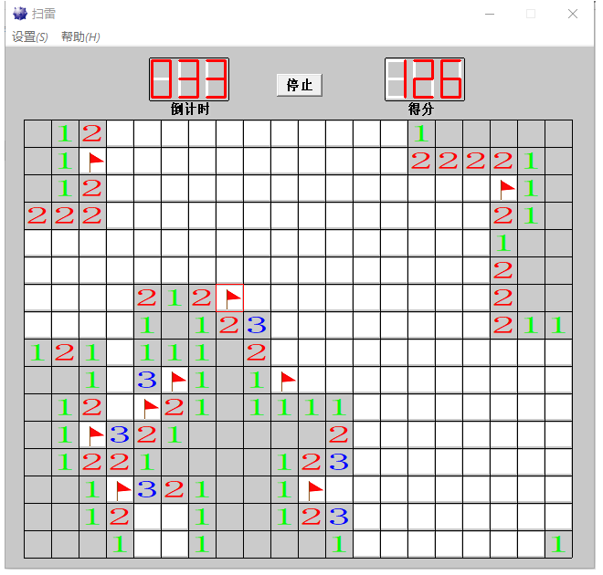
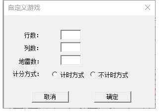
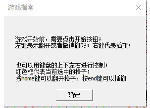

# Mine-Sweeper
这是一个在Windows运行下的扫雷程序，由Win32实现
## 游戏说明
游戏预设分高中低三个等级的游戏，另外也可以由玩家预设地图长宽和地雷数量。

游戏分为计时模式和不计时模式，在自定义模式中可以选择
## 界面展示
游戏主界面

结束场景

自定义规则

使用说明

## 注意事项

1. 源程序可能需要Visual Studio 2015 及以上版本打开；
2. 直接运行"扫雷.exe"在某些老旧的windows版本上可能需要添加一些运行库;

(๑•̀ㅂ•́)و✧ 嘣，一起来玩吧！